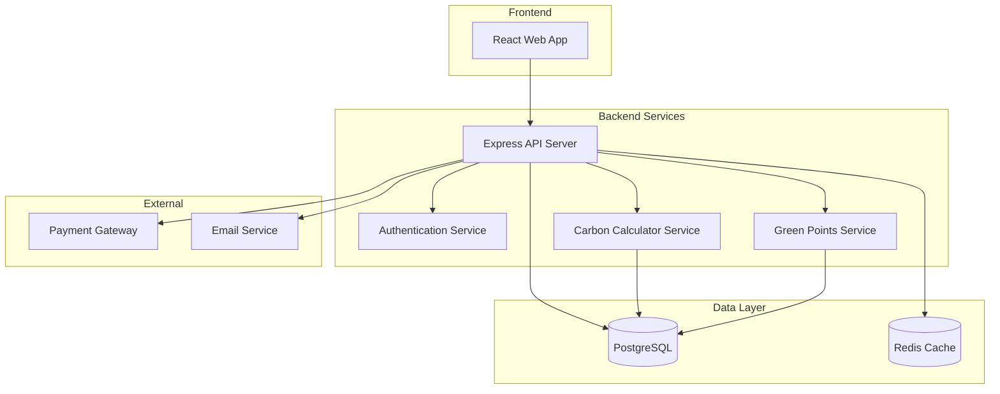
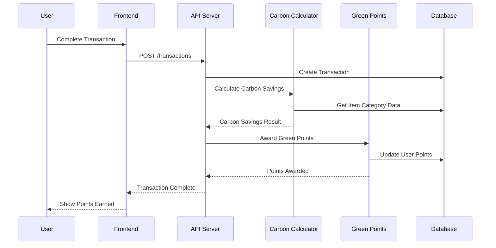
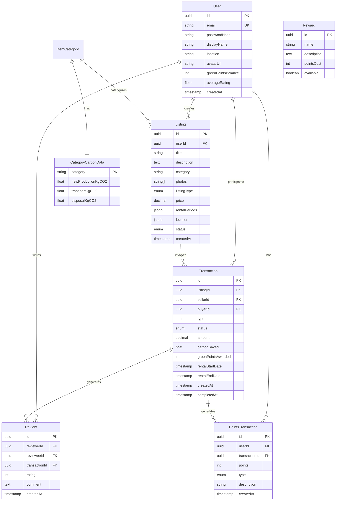

# Design Document: EcoSync Marketplace

## Overview

EcoSync is a web-based sustainable marketplace that enables users to rent or sell items while earning Green Points based on carbon footprint savings. The platform promotes circular economy principles by incentivizing reuse over new purchases.

The system consists of a React frontend, Node.js/Express backend API, PostgreSQL database, and a Carbon Calculator service that estimates environmental impact for each transaction.

## Architecture



### Request Flow



## Components and Interfaces

### 1. Authentication Service

Handles user registration, login, and session management.

```typescript
interface AuthService {
  register(email: string, password: string, profile: UserProfile): Promise<User>;
  login(email: string, password: string): Promise<AuthToken>;
  validateToken(token: string): Promise<User | null>;
  logout(token: string): Promise<void>;
}

interface UserProfile {
  displayName: string;
  location?: string;
  avatarUrl?: string;
}

interface AuthToken {
  accessToken: string;
  refreshToken: string;
  expiresAt: Date;
}
```

### 2. Listing Service

Manages item listings for rent or sale.

```typescript
interface ListingService {
  create(userId: string, listing: CreateListingInput): Promise<Listing>;
  update(listingId: string, updates: UpdateListingInput): Promise<Listing>;
  delete(listingId: string): Promise<void>;
  getById(listingId: string): Promise<Listing | null>;
  search(query: SearchQuery): Promise<PaginatedResult<Listing>>;
}

interface CreateListingInput {
  title: string;
  description: string;
  category: ItemCategory;
  photos: string[];
  listingType: 'rent' | 'sell';
  price: number;
  rentalPeriods?: RentalPeriod[];
  location: Location;
}

interface SearchQuery {
  keywords?: string;
  category?: ItemCategory;
  listingType?: 'rent' | 'sell';
  location?: Location;
  radius?: number;
  minPrice?: number;
  maxPrice?: number;
  sortBy?: 'price' | 'date' | 'greenPoints';
  page?: number;
  limit?: number;
}
```

### 3. Transaction Service

Processes rentals and sales between users.

```typescript
interface TransactionService {
  initiate(buyerId: string, listingId: string, details: TransactionDetails): Promise<Transaction>;
  confirmPayment(transactionId: string, paymentResult: PaymentResult): Promise<Transaction>;
  complete(transactionId: string): Promise<Transaction>;
  cancel(transactionId: string, reason: string): Promise<Transaction>;
  getByUser(userId: string): Promise<Transaction[]>;
}

interface TransactionDetails {
  type: 'purchase' | 'rental';
  rentalStartDate?: Date;
  rentalEndDate?: Date;
}

interface Transaction {
  id: string;
  listingId: string;
  sellerId: string;
  buyerId: string;
  type: 'purchase' | 'rental';
  status: 'pending' | 'paid' | 'completed' | 'cancelled';
  amount: number;
  carbonSaved: number;
  greenPointsAwarded: number;
  createdAt: Date;
  completedAt?: Date;
}
```

### 4. Carbon Calculator Service

Estimates carbon footprint savings for transactions.

```typescript
interface CarbonCalculatorService {
  calculateSavings(listing: Listing, transactionType: 'purchase' | 'rental'): Promise<CarbonSavings>;
  getCategoryData(category: ItemCategory): Promise<CategoryCarbonData>;
}

interface CarbonSavings {
  kgCO2Saved: number;
  equivalentTreesPlanted: number;
  equivalentCarMilesAvoided: number;
  calculationBreakdown: CalculationBreakdown;
}

interface CategoryCarbonData {
  category: ItemCategory;
  newProductionKgCO2: number;
  transportKgCO2: number;
  disposalKgCO2: number;
}

interface CalculationBreakdown {
  productionSaved: number;
  transportSaved: number;
  disposalAvoided: number;
  rentalFactor?: number;
}
```

### 5. Green Points Service

Manages point calculation, awarding, and redemption.

```typescript
interface GreenPointsService {
  calculatePoints(carbonSaved: number): number;
  awardPoints(userId: string, transactionId: string, points: number): Promise<void>;
  getBalance(userId: string): Promise<number>;
  getHistory(userId: string): Promise<PointsTransaction[]>;
  redeem(userId: string, rewardId: string): Promise<RedemptionResult>;
  getAvailableRewards(): Promise<Reward[]>;
}

interface PointsTransaction {
  id: string;
  userId: string;
  transactionId?: string;
  points: number;
  type: 'earned' | 'redeemed';
  description: string;
  createdAt: Date;
}

interface Reward {
  id: string;
  name: string;
  description: string;
  pointsCost: number;
  available: boolean;
}
```

### 6. Review Service

Handles user ratings and reviews.

```typescript
interface ReviewService {
  submit(reviewerId: string, transactionId: string, review: ReviewInput): Promise<Review>;
  getByUser(userId: string): Promise<Review[]>;
  getAverageRating(userId: string): Promise<number>;
  canReview(reviewerId: string, transactionId: string): Promise<boolean>;
}

interface ReviewInput {
  rating: number; // 1-5
  comment: string;
}

interface Review {
  id: string;
  reviewerId: string;
  revieweeId: string;
  transactionId: string;
  rating: number;
  comment: string;
  createdAt: Date;
}
```

## Data Models




## Correctness Properties

*A property is a characteristic or behavior that should hold true across all valid executions of a system—essentially, a formal statement about what the system should do. Properties serve as the bridge between human-readable specifications and machine-verifiable correctness guarantees.*

### Property 1: New User Zero Points Initialization

*For any* newly created user account, the Green Points balance SHALL be initialized to exactly zero.

**Validates: Requirements 1.4**

### Property 2: Authentication Round-Trip

*For any* valid user registration followed by login with the same credentials, the system SHALL successfully authenticate and return the same user identity.

**Validates: Requirements 1.1, 1.2**

### Property 3: Invalid Credentials Rejection

*For any* login attempt with credentials that don't match a registered user, the system SHALL reject the authentication and return an error.

**Validates: Requirements 1.3**

### Property 4: Listing CRUD Consistency

*For any* listing created with valid data, updating it with new values and then retrieving it SHALL return the updated values. Deleting a listing SHALL make it no longer retrievable.

**Validates: Requirements 2.1, 2.4, 2.5**

### Property 5: Listing Validation

*For any* listing creation attempt, the system SHALL accept only listings with a valid type ('rent' or 'sell'), and rental listings SHALL require rental period information. Listings missing required fields SHALL be rejected.

**Validates: Requirements 2.2, 2.3, 2.6**

### Property 6: Search Filter Accuracy

*For any* search query with filters applied, all returned listings SHALL match the specified keywords (if provided), belong to the specified category (if filtered), and be within the specified location radius (if filtered).

**Validates: Requirements 3.1, 3.2, 3.3**

### Property 7: Search Sort Order

*For any* search query with a sort option, the returned listings SHALL be ordered according to the specified sort criteria (price ascending/descending, date, or green points potential).

**Validates: Requirements 3.4**

### Property 8: Transaction Creation

*For any* valid transaction initiation (purchase or rental), the system SHALL create a transaction with 'pending' status. Rental transactions SHALL include the specified rental period dates.

**Validates: Requirements 4.1, 4.2**

### Property 9: Transaction State Transitions

*For any* pending transaction, confirming payment SHALL transition it to 'completed' status, and payment failure SHALL transition it to 'cancelled' status. No other transitions from 'pending' are valid.

**Validates: Requirements 4.3, 4.5**

### Property 10: Points Awarded to Both Parties

*For any* completed transaction, Green Points SHALL be awarded to both the buyer/renter AND the seller/owner. The points awarded SHALL be greater than zero.

**Validates: Requirements 5.3**

### Property 11: Carbon Calculation Consistency

*For any* item category with carbon data, the Carbon Calculator SHALL use that category's specific data. For categories without data, a default model SHALL be used. The calculation SHALL always produce a non-negative carbon savings value.

**Validates: Requirements 6.1, 6.2, 6.4**

### Property 12: Carbon Equivalents Calculation

*For any* carbon savings value in kgCO2, the system SHALL calculate equivalent metrics (trees planted, car miles avoided) using consistent conversion factors.

**Validates: Requirements 6.3**

### Property 13: Review Authorization

*For any* completed transaction, both parties SHALL be able to submit exactly one review each. Users without a completed transaction with another user SHALL NOT be able to review them.

**Validates: Requirements 7.1, 7.4**

### Property 14: Rating Average Update

*For any* new rating submitted, the reviewee's average rating SHALL be recalculated to include the new rating. The average SHALL always be between 1 and 5 inclusive.

**Validates: Requirements 7.2**

### Property 15: Redemption Balance Validation

*For any* redemption attempt, if the user's Green Points balance is greater than or equal to the reward cost, redemption SHALL succeed and deduct exactly the reward cost from the balance. If balance is insufficient, redemption SHALL fail and balance SHALL remain unchanged.

**Validates: Requirements 8.1, 8.2, 8.4**

## Error Handling

### Authentication Errors

| Error Code | Condition | Response |
|------------|-----------|----------|
| AUTH_001 | Invalid email format | 400 Bad Request with validation message |
| AUTH_002 | Email already registered | 409 Conflict |
| AUTH_003 | Invalid credentials | 401 Unauthorized |
| AUTH_004 | Token expired | 401 Unauthorized with refresh hint |
| AUTH_005 | Account locked | 403 Forbidden |

### Listing Errors

| Error Code | Condition | Response |
|------------|-----------|----------|
| LIST_001 | Missing required fields | 400 Bad Request with field list |
| LIST_002 | Invalid listing type | 400 Bad Request |
| LIST_003 | Rental missing period info | 400 Bad Request |
| LIST_004 | Listing not found | 404 Not Found |
| LIST_005 | Not authorized to modify | 403 Forbidden |

### Transaction Errors

| Error Code | Condition | Response |
|------------|-----------|----------|
| TXN_001 | Listing unavailable | 409 Conflict |
| TXN_002 | Invalid rental dates | 400 Bad Request |
| TXN_003 | Payment failed | 402 Payment Required |
| TXN_004 | Transaction not found | 404 Not Found |
| TXN_005 | Invalid state transition | 409 Conflict |

### Green Points Errors

| Error Code | Condition | Response |
|------------|-----------|----------|
| PTS_001 | Insufficient balance | 400 Bad Request |
| PTS_002 | Reward unavailable | 404 Not Found |
| PTS_003 | Reward out of stock | 409 Conflict |

### Review Errors

| Error Code | Condition | Response |
|------------|-----------|----------|
| REV_001 | No completed transaction | 403 Forbidden |
| REV_002 | Already reviewed | 409 Conflict |
| REV_003 | Invalid rating value | 400 Bad Request |

## Testing Strategy

### Unit Tests

Unit tests will verify specific examples and edge cases:

- **Authentication**: Test registration with edge case emails, password validation rules
- **Listings**: Test CRUD operations, validation of required fields
- **Transactions**: Test state machine transitions, payment integration
- **Carbon Calculator**: Test calculation with known category data
- **Green Points**: Test point calculation formula, redemption edge cases
- **Reviews**: Test rating average calculation, authorization checks

### Property-Based Tests

Property-based tests will use **fast-check** library for TypeScript to verify universal properties across randomly generated inputs. Each property test will run a minimum of 100 iterations.

**Test Configuration**:
```typescript
import fc from 'fast-check';

// Configure minimum 100 iterations
const propertyConfig = { numRuns: 100 };
```

**Property Test Implementation**:

1. **Property 1 (Zero Points)**: Generate random valid user profiles, create accounts, verify balance is 0
2. **Property 2 (Auth Round-Trip)**: Generate credentials, register, login, verify identity matches
3. **Property 3 (Invalid Credentials)**: Generate non-existent credentials, verify rejection
4. **Property 4 (Listing CRUD)**: Generate listings, perform CRUD, verify consistency
5. **Property 5 (Listing Validation)**: Generate invalid listings, verify rejection
6. **Property 6 (Search Filters)**: Generate listings and queries, verify filter accuracy
7. **Property 7 (Search Sort)**: Generate listings, apply sorts, verify order
8. **Property 8 (Transaction Creation)**: Generate valid transactions, verify pending status
9. **Property 9 (State Transitions)**: Generate transactions, apply transitions, verify states
10. **Property 10 (Points Both Parties)**: Complete transactions, verify both users get points
11. **Property 11 (Carbon Calculation)**: Generate categories, verify calculation uses correct data
12. **Property 12 (Carbon Equivalents)**: Generate CO2 values, verify equivalent calculations
13. **Property 13 (Review Authorization)**: Generate user pairs with/without transactions, verify access
14. **Property 14 (Rating Average)**: Generate rating sequences, verify average calculation
15. **Property 15 (Redemption Balance)**: Generate balances and rewards, verify redemption logic

### Test Tagging Convention

Each property test will be tagged with:
```typescript
// Feature: eco-marketplace, Property 1: New User Zero Points Initialization
// Validates: Requirements 1.4
```

### Integration Tests

Integration tests will verify end-to-end flows:

- Complete purchase flow: listing → transaction → payment → points awarded
- Complete rental flow: listing → rental → return → points awarded
- User journey: register → list item → sell → earn points → redeem reward
